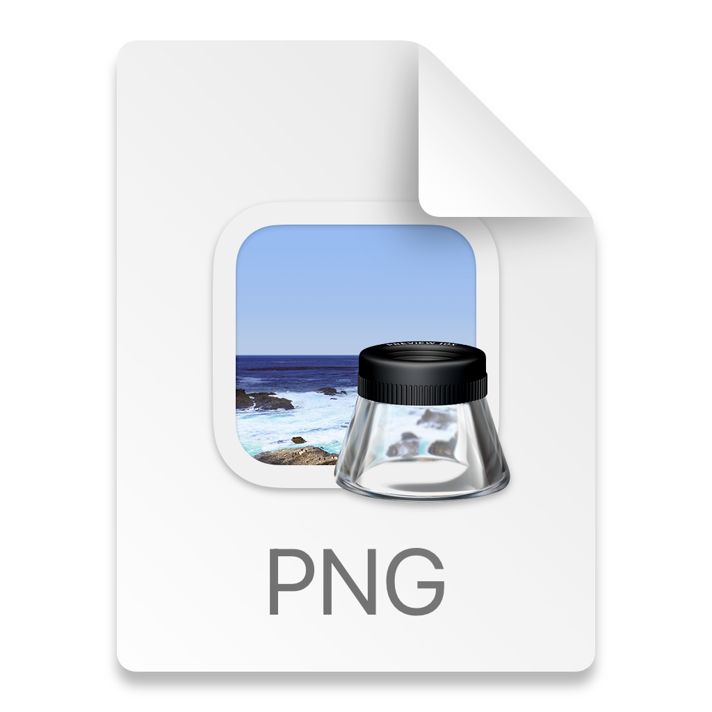

<p align="center"></p>

# bro-is-that-me

**macOS / Linux**
```sh
curl -fsSL https://raw.githubusercontent.com/pikalover6/bro-is-that-me/main/bro-is-that-me.py -o bro-is-that-me.py && python3 bro-is-that-me.py
```

**Windows (PowerShell)**
```powershell
irm https://raw.githubusercontent.com/pikalover6/bro-is-that-me/main/bro-is-that-me.py -OutFile bro-is-that-me.py; python bro-is-that-me.py
```

---

## What it is

A single Python script that generates a candid photo of you where you physically
are right now — styled like a still frame pulled from a nearby security camera.
It works out your location, finds real reference photos of the place, identifies
you from your own photo library, reads your device, and composites it all with an
image model. You answer a few prompts and it opens the result next to your other
pictures.

It is a party trick. Everything it does is gated behind a typed `I CONSENT`.

## How it works

1. **Pick a backend** — the agent runs on `codex` (OpenAI Codex CLI) or
   `claude` (Claude Code), each via an existing login or an API key you paste.
2. **Pick an image generator** — codex's built-in image tool, or the OpenAI
   `gpt-image-1` `images/edits` endpoint (`input_fidelity=high` for face
   fidelity). Anthropic has no image model, so those two are the options.
3. **Consent gate** — a bold warning lists exactly what will be accessed and what
   leaves your machine; you must type `I CONSENT`.
4. **A sandboxed agent** figures out your OS and does the work: installs
   Playwright, reads geolocation from headless Chrome (falls back to IP),
   reverse-geocodes it via OpenStreetMap, web-searches real photos of the place,
   finds a clear photo of you in your own picture folders, inspects your device,
   then **attaches** your real photos to the image model (it never describes
   them) and renders the frame.
5. The launcher moves the result to your Pictures folder and opens it.

A live progress bar is driven by markers the agent prints after each step, so you
never see its chain-of-thought and no extra window opens.

## The sandbox (this is the important part)

The agent's **writes are confined to a single temp folder by the OS kernel** —
not by asking it nicely. A hallucinating or mistaken agent physically cannot
write to your Documents, Pictures, or anywhere else.

| Platform | codex runner | claude runner |
|----------|--------------|---------------|
| macOS    | native Seatbelt (`workspace-write`) | launcher wraps it in `sandbox-exec`, default-deny writes |
| Linux    | native Landlock + seccomp | launcher wraps it in **bubblewrap** (read-only root, writable workdir) |
| Windows  | no kernel sandbox — use **WSL** (→ Linux path) | same — use WSL |

Reads and network stay open (the tool needs them); only writes are locked down.
If a hard sandbox can't be established, the launcher **refuses to run** rather
than trust the prompt (override with `BRO_ALLOW_UNSANDBOXED=1` at your own risk).
On the codex runner this is codex's own sandbox; on the claude runner the launcher
imposes it, because Claude Code has no native OS-level filesystem sandbox.

## Requirements

- Python 3, Node.js + npm, a Chromium-based browser (Chrome/Edge/Chromium).
- One of: Codex CLI (`codex login`) or Claude Code (`claude`) — matching your pick.
- An OpenAI API key if you choose the OpenAI image path or the OpenAI-key backend.
- Location Services enabled for the browser (else it degrades to city-level IP).

## Notes

- API keys are read silently, never written to disk, and passed to the agent only
  via its environment (never argv, so they don't show up in the process list).
- Timeouts kill a stuck agent (overall + idle caps).
- Model ids and timeouts are constants at the top of the script.
- `BRO_VERBOSE=1` streams the agent's raw output for debugging.
